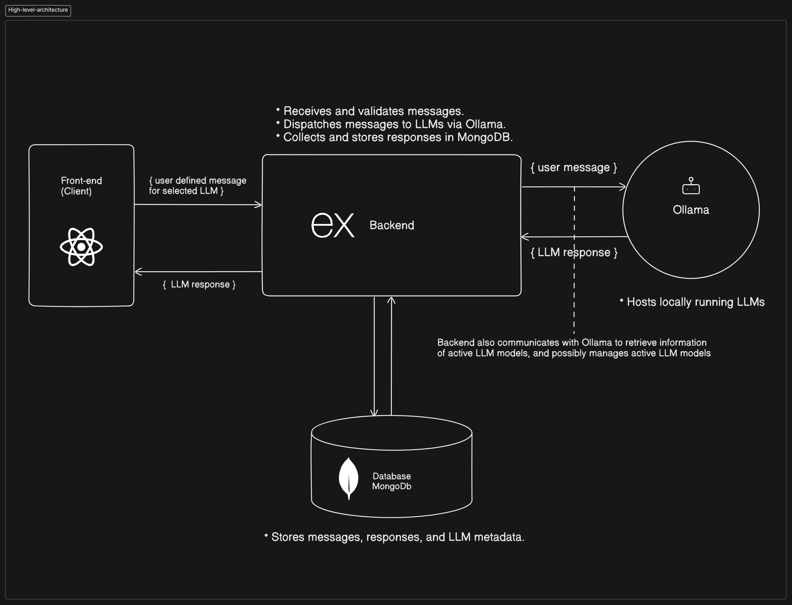

# LLM Message Dispatch Tool Architecture

- **Frontend (React App)**
    -  Allows user to select model to interact with
    - Allows users to input JSON messages for selected model
    - Displays results from LLM responses
- **Backend (Express.js App)**
    - Client fetches information about selectable models (Backend get this information from Ollama and mongoDB)
    - Receives and validates user messages.
    - Dispatches messages to LLMs running in Ollama.
    - Collects and stores responses in MongoDB.
    - Sends responses to the Client which renders them for user.
- **Database (MongoDB)**
    - Stores messages, responses, and LLM metadata.
- **LLM Integration (Ollama)**
    - Hosts and processes user-defined messages with local LLMs.
    - Running LLMs metadata must be stored into MongoDB which should have up-to-date information of running models that user can interact with. Backend will manage LLMs (initialize, start, stop)  running in Ollama, these actions can be possibly implemented in Client, so user can manage Ollama through client and backend.

