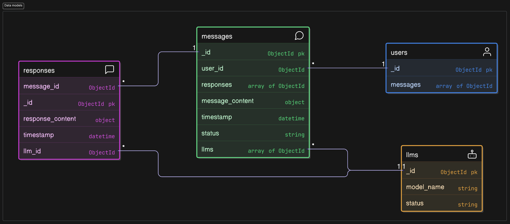

# Data Models for MongoDB

MongoDB is a solid choice for our project.

It is great for storing JSON-based messages and responses. 

Its flexible schema makes it easy to store structured but variable data without strict constraints.

1. Scalability: Handles large volumes of responses efficiently.
2. Flexible Schema: Supports dynamic message structures.
3. Indexing & Querying: Enables efficient searches and filtering.
4. Easy Integration: Works smoothly with Node.js and Express.


## Entities and relations


### Collection users:
```
users {
  _id ObjectId pk
  messages array of ObjectId
}
```

Collection has _id column

- Primary key for the collection

Collection has messages column, which is array of ObjectIds (messages)

- We need this column in order to maintain relation for messages that the user has sent from client

### Collection llms:
```
llms {
  _id ObjectId pk
  model_name string
  status string
}
```

Collection has _id column

- Primary key for the collection, ObjectId
Collection has model_name column

- stores selectable model name, string
- example: "Deepseek-r1"

Collection has status column

- Stores status of the model, string
- "active" | "inactive" |

### Collection messages

```
messages {
  _id ObjectId pk
  user_id ObjectId
  responses array of ObjectId
  message_content object
  timestamp datetime
  status string
  llms array of ObjectId
}

```

Collection has _id column

- Primary key for collection, ObjectId

Collection has user_id column

- Stores ID of user that has sent the message

Collection has responses column, Object (array of ids) (IS THIS NEEDED?)

- Stores responses from each LLM for this user message

Collection has message_content column, object

- Stores message content that user inputted from client

Collection has timestamp column, datetime

- Stores timestamp when message was created (user sent it from client)

Collection has status column, string

- Stores status of the message ("pending" | "ready") (IS THIS NEEDED?)
- Possibly needed for UI to show that responses are not yet ready for this message. When all responses are ready and, message is "ready"

Collection has llms column, object (array of ids)

- Stores array of id of llms that this message was pointed for

### Collection responses
```
responses {
  _id ObjectId pk
  message_id ObjectId
  llm_id ObjectId
  response_content object
  timestamp datetime
}
```

Collection has _id column, ObjectId

- Primary key for this collection

Collection has message_id column, ObjectId

- Stores id of message this response was for

Collection has llm_id column, ObjectId

- Stores id of llm that generated this response

Collection has response_content column, object

- Actual response object from LLM (Ollama service)

Collection has timestamp column, datetime

- Timestamp for when this response was generated by LLM (In ollama service)


